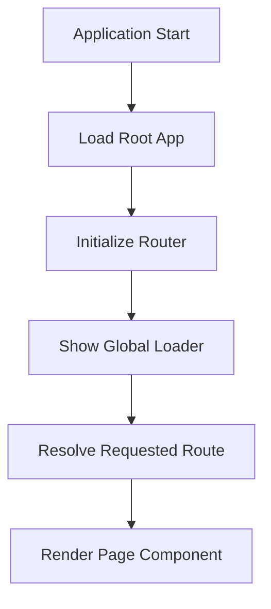
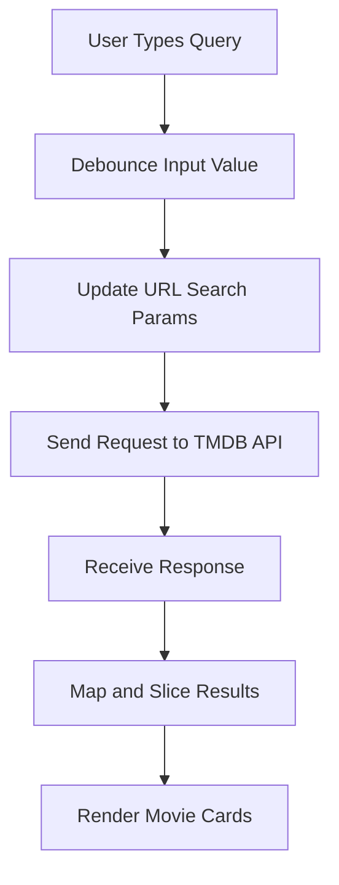
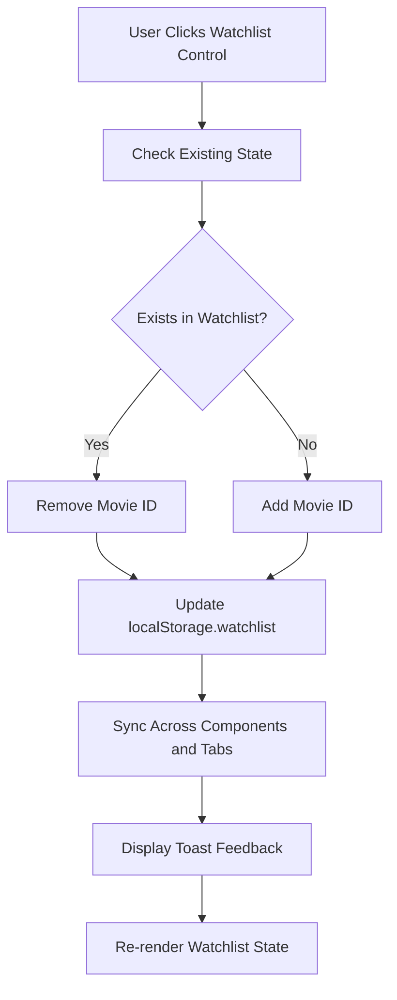
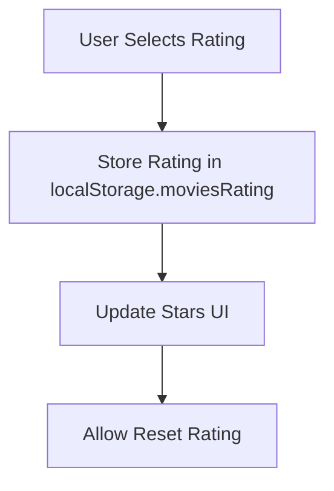
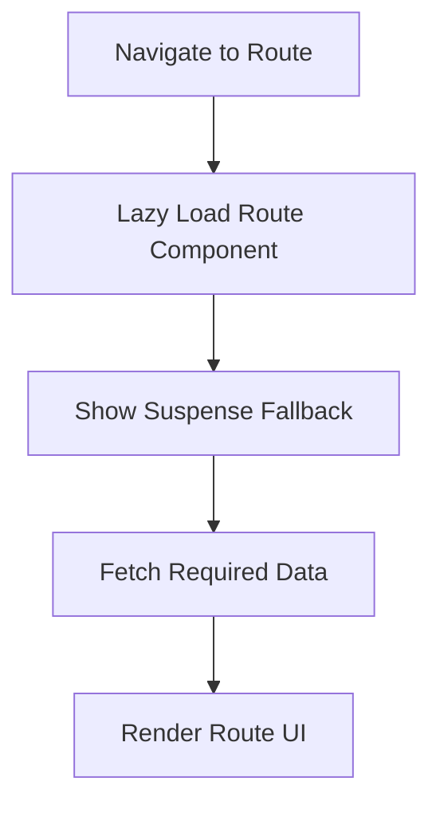
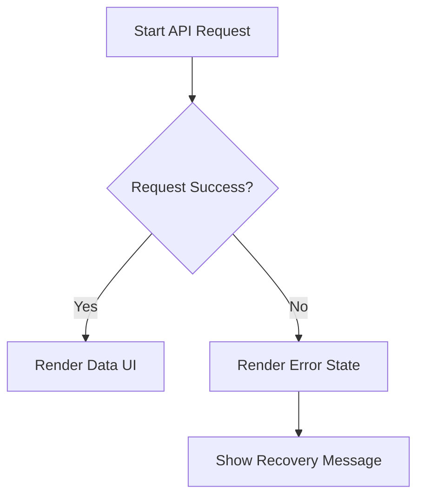

# 🔄 Program Flow – CinemaCorn

## 📌 Application Lifecycle Overview

CinemaCorn follows a component-driven SPA architecture using React Router and lazy-loaded routes.

## 🚀 Initial Application Flow

## 🔍 Movie Search Flow

## ❤️ Watchlist Flow

## ⭐ Rating System Flow

## 🛣️ Route Navigation Flow

## ⚠️ Error Handling Flow

