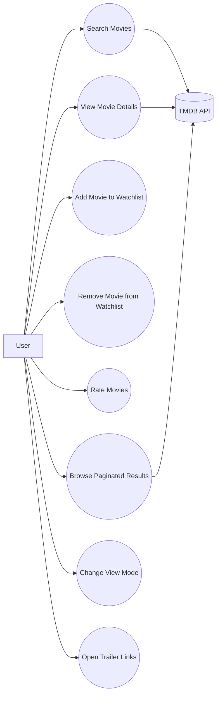
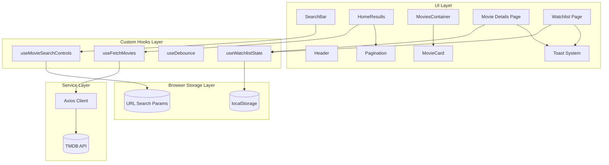
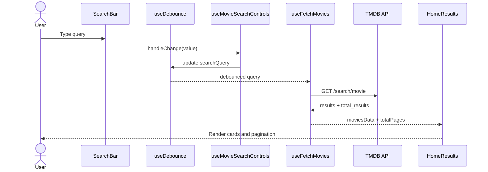
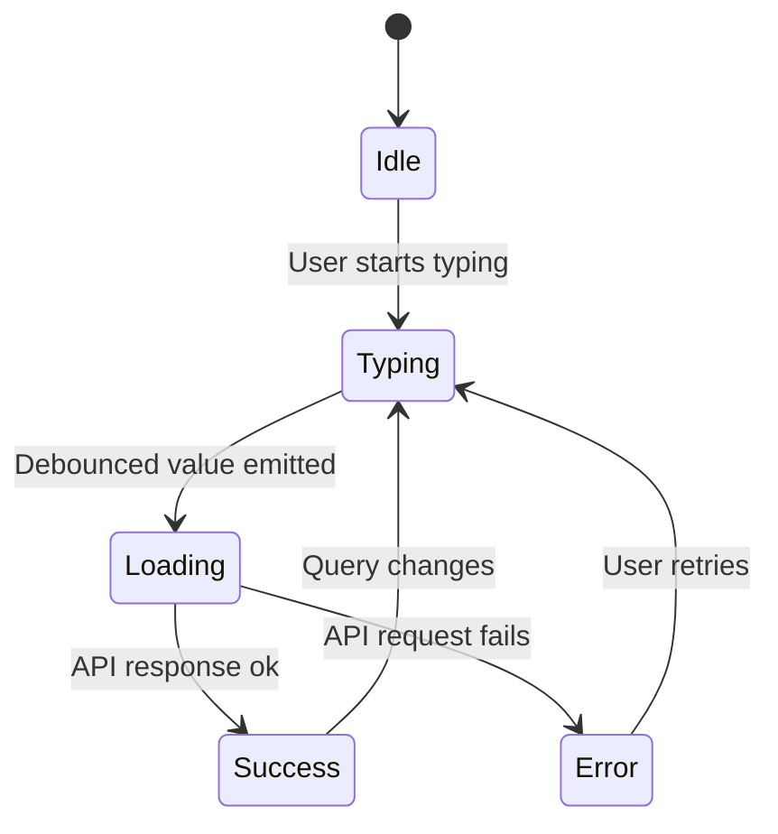
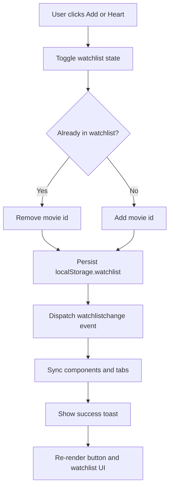

# 🎯 UML Diagrams – CinemaCorn

## 📌 Purpose

This document describes the architectural and behavioral UML diagrams used to model the CinemaCorn application.

## 🧩 Use Case Diagram

## 🧱 Component Diagram

## 🔄 Sequence Diagram (Search Flow)

## 🧠 State Diagram (Movie Search)

## ✅ Activity Diagram (Watchlist Toggle)

